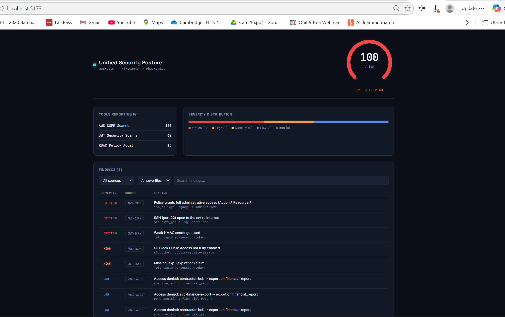
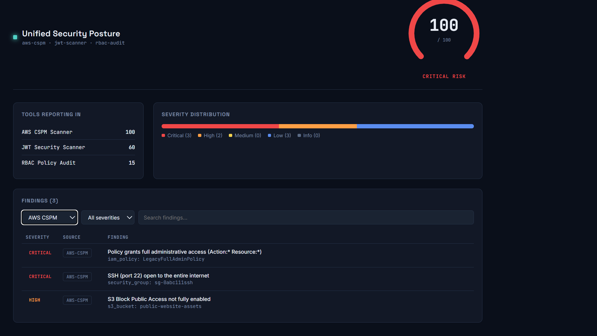
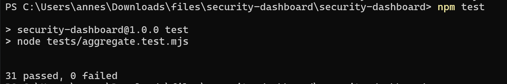

# Unified Security Posture Dashboard

A single-pane-of-glass dashboard that aggregates findings from three
independently-built security tools — my AWS CSPM scanner, my JWT
security scanner, and my RBAC policy engine's audit log — into one
unified view: an overall risk score, a per-tool breakdown, a severity
distribution, and a filterable findings table.

This is deliberately the "flagship" piece tying the rest of my security
projects together: it's not a standalone security tool, it's the layer
that makes several standalone tools legible as one coherent security
posture, which is exactly the problem real security dashboards (Splunk
ES, a SOC's internal tooling, DefectDojo) exist to solve.

## Design decisions

**Data aggregation is framework-free.** `src/lib/aggregate.js` has zero
React dependency — every normalization/scoring/filtering function is
plain JavaScript, testable by running Node directly with no build step
(`node tests/aggregate.test.mjs`). This mirrors the same separation used
in my other projects (`cspm/engine.py` never touches boto3,
`reference_engine.py` never touches OPA): keep the actual logic testable
in isolation from whatever framework or SDK surrounds it.

**Risk scoring is consistent across tools.** The severity weights here
(`CRITICAL: 40, HIGH: 20, MEDIUM: 10, LOW: 5, INFO: 1`) are identical to
`aws-cspm-scanner/cspm/engine.py`'s `compute_risk_score`. A score of 72
means the same thing whether reported by the CSPM tool alone or by this
dashboard aggregating across tools — a deliberate consistency decision.

**Visual design.** Dark, information-dense theme — a real ergonomic
choice for a tool meant to be glanced at frequently (the same reasoning
SOC tooling uses dark themes, not just an aesthetic default). Palette:
navy base (`#0a0f1a`), teal signature accent (`#4fd1c5`), and a distinct
5-color severity scale that's functional (matches common
red/orange/yellow/blue/gray severity conventions) rather than decorative.
Typography: Space Grotesk for headers, Inter for body text, JetBrains
Mono for data/IDs/scores — the mono face is used specifically for numbers
and resource identifiers so they read as *data*, distinct from prose.

**The risk gauge (signature element).** A hand-rolled SVG arc gauge, not
a charting library — for one gauge, a library dependency isn't worth the
weight or the added risk of an untested integration.

## Setup

```bash
git clone <your-fork-url>
cd security-dashboard
npm install
npm run dev
```

Opens at `http://localhost:5173` with the bundled sample dataset
(`src/data/sample-findings.json`), which mixes real-shaped output from
all three source tools with intentionally severe findings so the
dashboard has something meaningful to show on first run.

## Running the tests

```bash
npm test
# or directly: node tests/aggregate.test.mjs
```

31 tests covering every normalization function, risk scoring (including
the 100-point cap), severity counting, and filter combinations — runs in
under a second with zero dependencies since it's plain Node executing
plain JS modules.

## Connecting real data instead of the sample

Replace the import in `src/App.jsx`:

```js
// Instead of:
import sampleData from "./data/sample-findings.json";

// Fetch live output from your other tools, e.g.:
const awsReport = await fetch("/api/aws-report.json").then(r => r.json());
const jwtReport = await fetch("/api/jwt-report.json").then(r => r.json());
const rbacLog = await fetch("/api/audit.log.jsonl").then(r => r.text())
  .then(text => text.trim().split("\n").map(JSON.parse));
```

The exact shapes expected are documented in the docstrings at the top of
each `normalize*` function in `src/lib/aggregate.js` — they match the real
JSON output formats from `aws-cspm-scanner/scripts/run_scan.py --json`,
`jwt-security-scanner`'s `--json` CLI flag, and
`rbac-abac-policy-engine/service/audit_logger.py`'s JSON-Lines format,
respectively.

## Screenshots

### Full dashboard

The full dashboard running at `localhost:5173` — risk gauge (100/100,
critical), tools reporting in (AWS CSPM, JWT Scanner, RBAC Audit each
with their own score), severity distribution bar, and the combined
findings table across all three sources.

### Filtered findings table

The findings table filtered to a single source (AWS CSPM), showing the
3 findings from that tool in isolation — full-admin IAM policy, SSH open
to the world, and S3 Block Public Access disabled.

### Test suite

`npm test` — all 31 tests passing, covering every normalization function,
risk scoring, severity counting, and filter combination logic.

## Testing status

- ✅ **Full build verified end to end**: `npm install && npm run dev`
  runs cleanly and the dashboard renders correctly in the browser at
  `localhost:5173` — risk gauge, tools breakdown, severity distribution,
  and the findings table with working filters, all confirmed visually.
- ✅ All 31 `aggregate.js` unit tests pass via `npm test`.
- ✅ Filtering by source (e.g. isolating just AWS CSPM findings) works
  correctly, showing only the 3 findings from that source with the
  count updating accordingly.

## Limitations

- Sample data is static; there's no live polling/websocket setup for a
  truly "real-time" dashboard — a natural next step would be a small
  backend that periodically re-runs the three scanners and serves fresh
  JSON.
- No persistence/history — the dashboard shows current findings, not a
  trend line over time. Pairing this with a simple time-series backend
  would let you show "risk score over the last 30 days," which is often
  more interesting to a reviewer than a single snapshot.
- No auth — this is a portfolio demo; a real internal security dashboard
  would sit behind SSO.

## License

MIT — see [LICENSE](./LICENSE).
